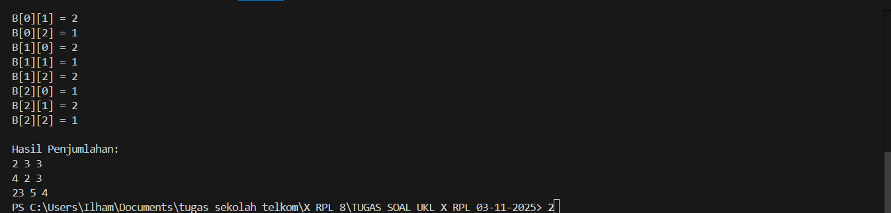

🔢 Program Penjumlahan Matriks 3x3
📘 Deskripsi

Program ini digunakan untuk melakukan penjumlahan dua matriks berordo 3x3.
Pengguna akan diminta untuk memasukkan nilai elemen-elemen dari matriks A dan matriks B, kemudian program akan menghitung dan menampilkan hasil penjumlahannya dalam bentuk matriks hasil.

Program ini ditulis menggunakan bahasa Java dan memanfaatkan konsep array dua dimensi serta perulangan bersarang (nested loop).

⚙️ Cara Kerja Program

Program menampilkan judul “PENJUMLAHAN MATRIKS 3x3”.

Pengguna menginputkan elemen-elemen matriks A (3 baris × 3 kolom).

Pengguna kemudian menginputkan elemen-elemen matriks B (3 baris × 3 kolom).

Program menjumlahkan kedua matriks menggunakan perulangan bersarang:

𝐻
𝑎
𝑠
𝑖
𝑙
[
𝑖
]
[
𝑗
]
=
𝑀
𝑎
𝑡
𝑟
𝑖
𝑘
𝑠
𝐴
[
𝑖
]
[
𝑗
]
+
𝑀
𝑎
𝑡
𝑟
𝑖
𝑘
𝑠
𝐵
[
𝑖
]
[
𝑗
]
Hasil[i][j]=MatriksA[i][j]+MatriksB[i][j]

Program menampilkan hasil penjumlahan dalam bentuk matriks 3x3.

🧩 Kode Program
package SOALSULIT_2;
import java.util.Scanner;

public class soalnumber3bagian2 {
    public static void main(String[] args) {
        Scanner scanner = new Scanner(System.in);
        
        System.out.println("PENJUMLAHAN MATRIKS 3x3");
        
        int[][] matriksA = new int[3][3];
        int[][] matriksB = new int[3][3];
        int[][] hasil = new int[3][3];
        
        // Input matriks A
        System.out.println("Masukkan elemen matriks A (3x3):");
        for (int i = 0; i < 3; i++) {
            for (int j = 0; j < 3; j++) {
                System.out.print("A[" + i + "][" + j + "] = ");
                matriksA[i][j] = scanner.nextInt();
            }
        }
        
        // Input matriks B
        System.out.println("Masukkan elemen matriks B (3x3):");
        for (int i = 0; i < 3; i++) {
            for (int j = 0; j < 3; j++) {
                System.out.print("B[" + i + "][" + j + "] = ");
                matriksB[i][j] = scanner.nextInt();
            }
        }
        
        // Penjumlahan matriks
        for (int i = 0; i < 3; i++) {
            for (int j = 0; j < 3; j++) {
                hasil[i][j] = matriksA[i][j] + matriksB[i][j];
            }
        }
        
        // Output hasil
        System.out.println("\nHasil Penjumlahan:");
        for (int i = 0; i < 3; i++) {
            for (int j = 0; j < 3; j++) {
                System.out.print(hasil[i][j] + " ");
            }
            System.out.println();
        }
        
        scanner.close();
    }
}

🧾 Contoh Hasil Program
PENJUMLAHAN MATRIKS 3x3
Masukkan elemen matriks A (3x3):
A[0][0] = 1
A[0][1] = 2
A[0][2] = 3
A[1][0] = 4
A[1][1] = 5
A[1][2] = 6
A[2][0] = 7
A[2][1] = 8
A[2][2] = 9

Masukkan elemen matriks B (3x3):
B[0][0] = 9
B[0][1] = 8
B[0][2] = 7
B[1][0] = 6
B[1][1] = 5
B[1][2] = 4
B[2][0] = 3
B[2][1] = 2
B[2][2] = 1

Hasil Penjumlahan:
10 10 10 
10 10 10 
10 10 10 

🖼️ Screenshot Hasil Program
